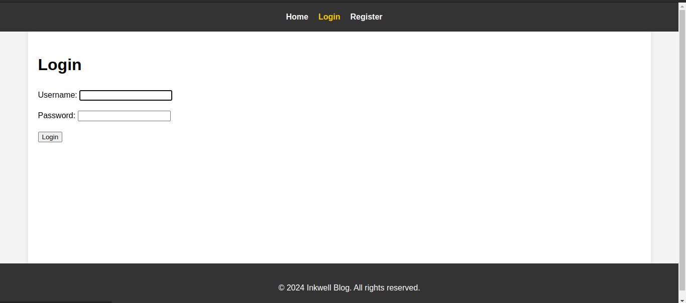
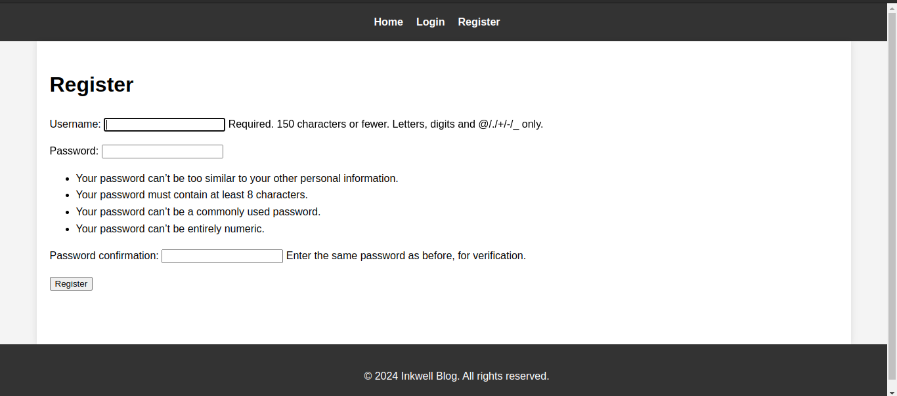
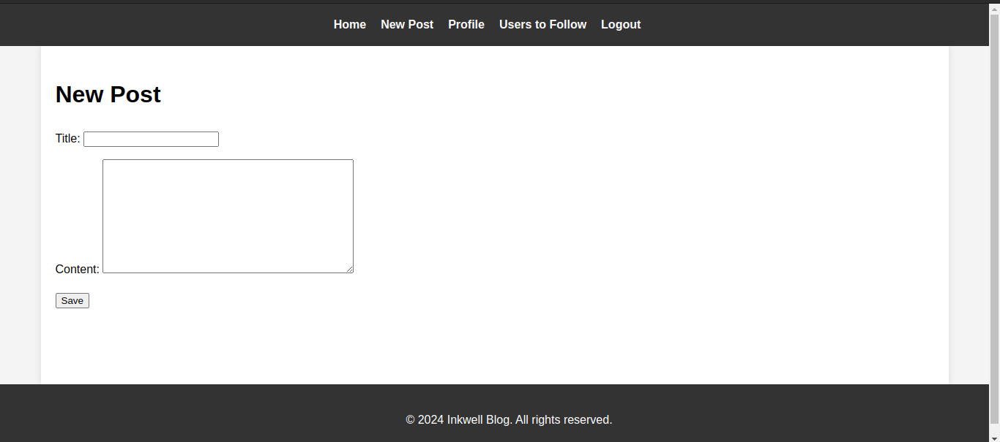
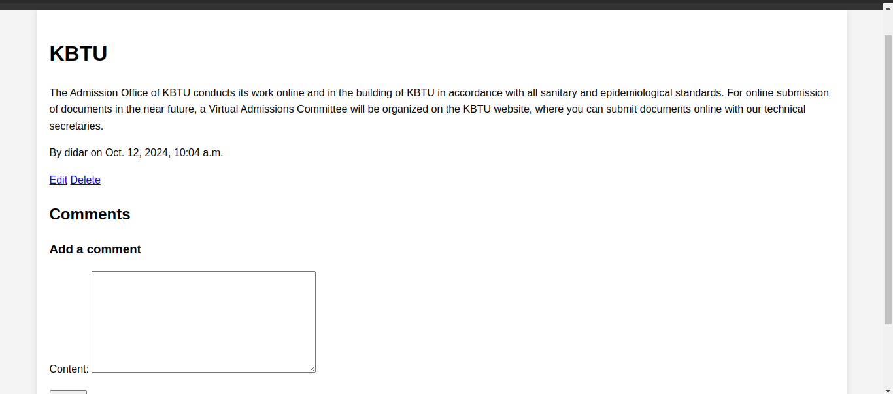
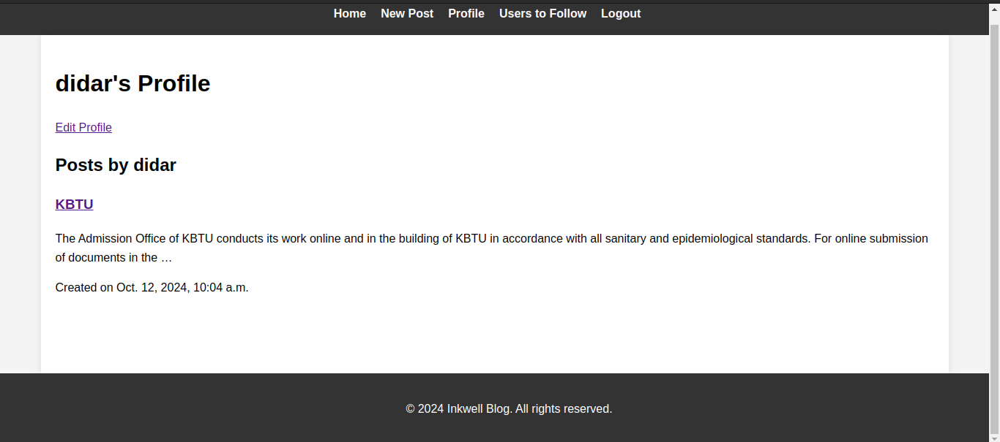
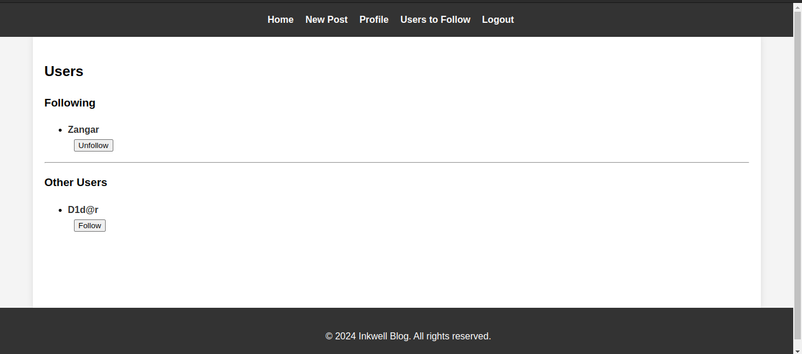
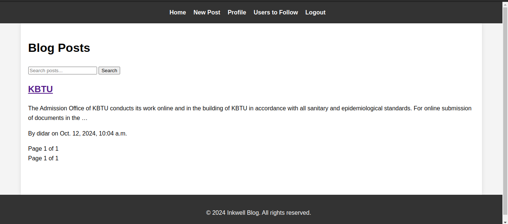

# Inkwell Blog

Welcome to **Inkwell Blog** – a simple blogging platform built with Django. This project allows users to create, read, and manage blog posts while enabling user interactions through a follow system.

## Features

- User registration and authentication

- Create, read, update, and delete blog posts

- User profiles with bio and profile pictures

- Follow and unfollow other users

- Pagination for post lists
- Search functionality for blog posts

## Technologies Used

- **Backend**: Django
- **Database**: Sqlite3
- **Frontend**: HTML, CSS

